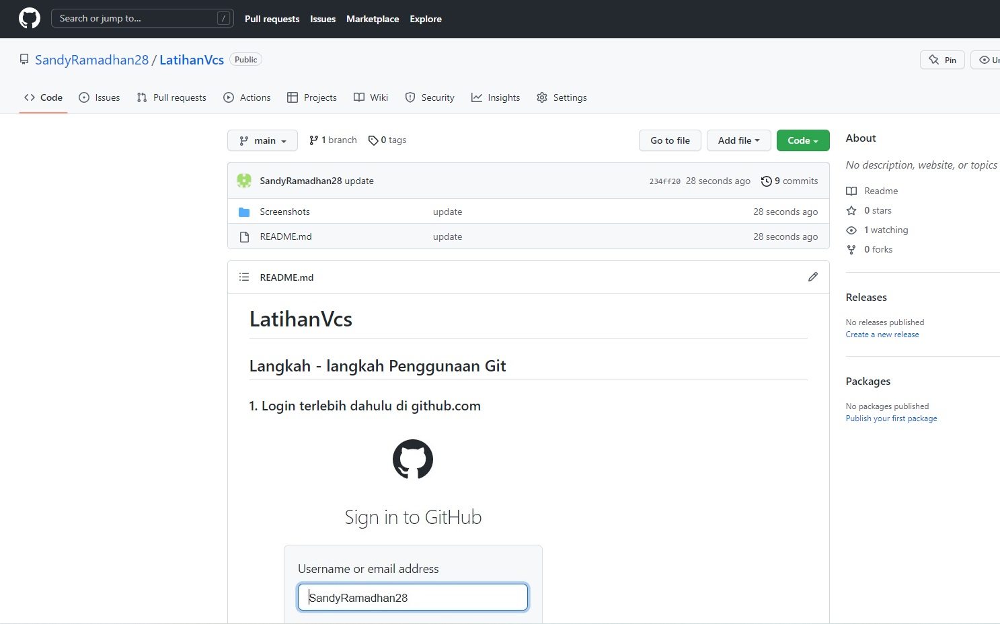

# LatihanVcs
## Langkah - langkah Penggunaan Git
### 1. Login terlebih dahulu di github.com

### 2. Setelah login buat Repository baru pada github.com

### 3. Buat Nama Repositori LatihanVCS setelah ikuti gambar yang dibawah ini

### 4. Login pada git bash menggunakan username dan email GitHub

### 5. Masuk ke github dan copy link HTTPS untuk clone

Lakukan git clone https://github.com/SandyRamadhan28/LatihanVcs.git untuk memindahkan file yang ada pada github ke direktori C
untuk mengecek https pada web dengan klik code pada repository

### 6. Pindahkan penyimpanan ke folder yang diinginkan

### 7. Setelah itu lakukan syntax git clone https://github.com/SandyRamadhan28/LatihanVcs.git

#### Cek direktori pada folder C di Laptop

### 8. Buka folder LatihanVCS, buka file README.md, dan edit file README.md 

### 9. Tambahkan syntax git add README.md

### 10. Tambahkan syntax git commit "Update file"

### 11. Tambahkan syntax git push -u origin main

### 12. Cek repository pada akun github

SELESAI.
